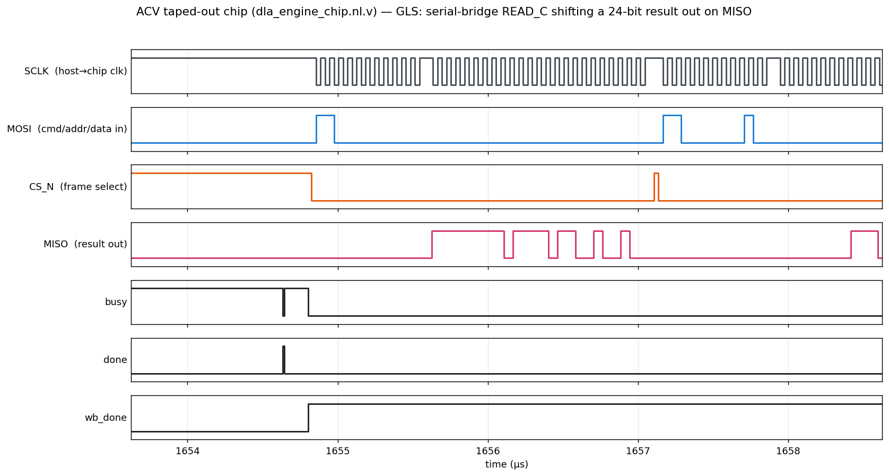
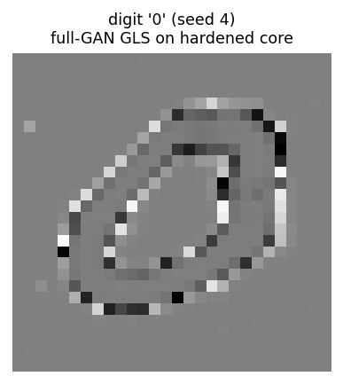
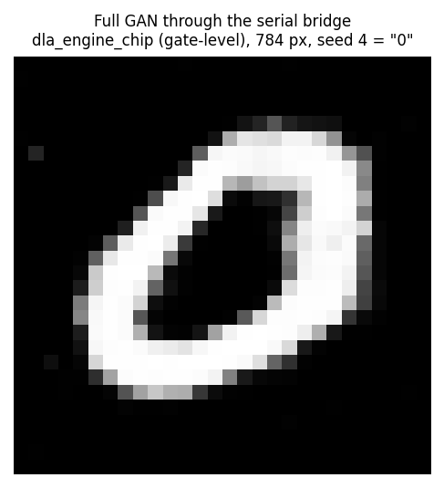
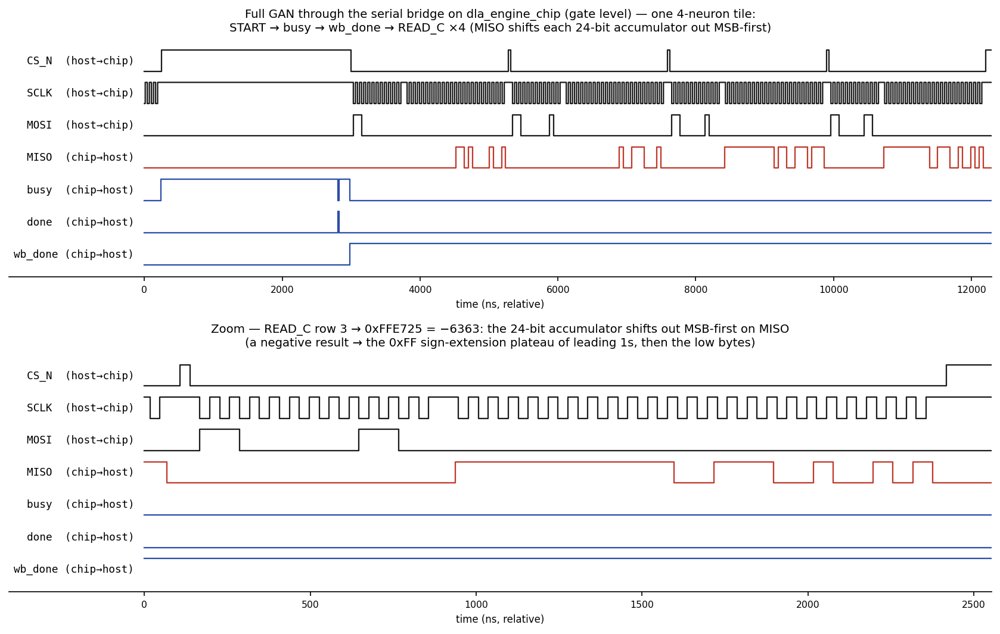

# Learning Notes — APIC_A DLA Chip

A study guide for understanding this project deeply: what the chip is, how it is built,
and — the main purpose of this file — a worked log of the **errors, problems, nuances, and
key insights** encountered while integrating the accelerator into the Chipathon 2026 **A56 /
ACV** padframe (the 2026-08-22/23 session). Each problem is written as *symptom → diagnosis →
fix → the concept behind it*, so you can re-derive the reasoning (e.g. for an interview), not
just recall the outcome. CLAUDE.md is the terse resume-work reference; this file is for
*understanding*.

---

## Part 1 — The project in one page

**What it is.** A tapeout-oriented **Deep Learning Accelerator (DLA)** that runs a pre-trained,
INT8-quantized **MNIST GAN generator** on the open-source **GF180MCU** 180 nm PDK, taken all the
way to GDS with the open **LibreLane** RTL-to-GDS flow, for the Chipathon 2026 shuttle.

**The stack (HW/SW co-design):**
1. **Model → INT8**: a PyTorch GAN generator (a 64→256→256→784 MLP) is quantized to INT8;
   Python scripts emit the weights and per-layer requantization constants.
2. **RTL**: synthesizable Verilog for a 4×4 multiply-accumulate (MAC) engine + SRAM operand
   buffers + a control FSM. Tapeout boundary = `dla_engine_top`.
3. **Physical**: LibreLane hardens that RTL onto real GF180 **SRAM macros** and 3.3 V standard
   cells → DRC/LVS/antenna/timing sign-off → GDS.
4. **Integration**: the hardened core is wrapped with a serial host link and dropped into a
   shared multi-project **padframe**.

**The mental model to carry into an interview:** *"It's a small INT8 systolic-style matrix
engine with hard SRAM macros, verified bit-exact against a Python golden model, hardened in an
open PDK flow, and integrated behind a serial link into a shared padring."*

---

## Part 2 — Architecture concepts (the things an interviewer probes)

### 2.1 N vs K — spatial vs temporal
`dla_engine_top` has two size parameters:
- **N (spatial)** = the literal PE-array size. `N=4` → 4×4 = **16 physical MAC units** on the
  die, all working every cycle.
- **K (temporal)** = how many cycles those 16 PEs accumulate before a result is final. `K=256`
  → each PE does 256 multiply-accumulates over 256 cycles. K is a *loop count*, not silicon.

**Why it matters:** growing K costs *time + memory depth*, not area. The A/B SRAMs are 256 deep,
so `K=256` needs no new hardware — just uses depth that was already there. (Historically the
chip was mistakenly hardened at `K=4` — see §5.1; a great "verify what you actually tape out"
lesson.)

### 2.2 It is a broadcast grid, NOT a true systolic array
`dla_pe_array.v` has **zero PE-to-PE connections**. Every PE in row *i* gets the same A byte;
every PE in column *j* gets the same B byte (row/column **broadcast**); each PE accumulates into
its own private 24-bit register. It shares the systolic array's *grid topology* and
*output-stationary* schedule but not its *wave pipelining* (no operands or partial sums
"trickle" between neighbours). At N=4 the broadcast fan-out is only 4, so this is the right call
— and those broadcast SRAM→PE nets are the timing-critical path.
> **Interview trap:** don't call it "systolic" without this caveat. Being able to state the
> difference (broadcast vs wave-pipelined) is exactly the kind of precision they look for.

### 2.3 The memory — why 8 macros, arranged the way they are
- **A buffer = 4 macros, B buffer = 4 macros.** A and B each need **4 parallel 8-bit lanes**
  (all 4 rows and all 4 columns feed the grid every cycle) → one 256×8 macro per lane.
- **C buffer = flip-flops** (this "longtin" variant). C holds one 24-bit result at a time for
  16 words; 256×8 macros are a clumsy fit for a 24-bit word, so C moved out of SRAM into ~408
  registers. That removed the 9th SRAM macro and made the design **antenna-free**.
- The A and B buffers have **different address layouts** (A: `row*K+k`; B: `k*N+col`) because A
  holds N independent weight rows while B holds the shared input broadcast across N columns.
  This asymmetry has bitten testbenches twice (see §5.4) — worth remembering.

### 2.4 Why a serial bridge exists (the pin-budget problem)
`dla_engine_top`'s native interface is **~53 signal bits** (`wr_addr[9:0]`, `wr_data[7:0]`,
`rd_data[23:0]`, `rd_addr[3:0]`, plus handshakes). A padframe slot exposes only a handful of
pads. `rtl/dla_serial_bridge.v` is a hand-rolled **4-wire serial link** (SCLK / MOSI / CS_N /
MISO) that shifts commands/addresses/data through 4 pads instead of wiring 53 wires out. It
double-flops the async inputs (SCLK is treated as *data*, edge-detected — deliberately avoiding
true clock-domain-crossing design since we own both ends).

Frame format (MSB-first while CS_N low): `CMD[1:0] + ADDR[9:0]`, then `WRITE_A`/`WRITE_B` shift 8
data bits, `START` pulses compute, `READ_C` streams 24 bits out on MISO.

---

## Part 3 — The Chipathon submission model (essential context for this session)

**What changed.** The chipathon moved from a single generic "workshop slot" padframe (that
every team shared) to **per-project block assignments**: each project gets a specific block
config, and the **auditor generates that project's real padframe from its `info.yaml`** and
hands back a DEF template + a reference padring.

**We are project A56, block "ACV"** — a **1675 × 1110 µm** project region whose 11 user pins sit
on the **west + north edges**:

| Pad | Slot | Cell | Role |
|---|---|---|---|
| (quiet gnd) | W12 | dvss | fixed down-bonded ground of the quadrant (in the frame, not our pin) |
| clk | W13 | in_s (schmitt) | dedicated input |
| rst_n | W14 | in_c (cmos) | dedicated input |
| SCLK, MOSI, CS_N, MISO | W15–W18 | bi_24t | serial link |
| busy, done, wb_done | W19–W21 | bi_24t | status outputs |
| DVDD | W22 | dvdd | power |
| DVSS | N01 | dvss | ground |

**How the audit works** (and what it caught): the auditor scans the submitted GDS for
**top-level text labels** and matches them against the `info.yaml` pin list. A `*` means "pin in
info.yaml but **no matching label in the GDS**". Our audit row flagged
`SCLK/MOSI/CS_N/MISO/DVDD/DVSS` missing and **52 "unmatched"** parallel pins present.

**Root cause of the whole session's work:** we had submitted the **bare `dla_engine_top` core**
(the raw 53-bit parallel interface + VDD/VSS) — the serial bridge existed in RTL but had never
been *hardened into the submitted GDS*. The fix is to harden a **bridge-wrapped top** whose only
pins are the 11 ACV pins.

> **Concept — block vs chip.** In this model, *we deliver a block*; the organiser stitches
> blocks into the reticle and owns chip-level power + top-level LVS/DRC. This distinction
> resolves several judgment calls later (§5.7).

---

## Part 4 — What was built this session

1. **`rtl/dla_engine_chip.sv`** — a new chip-level top that instantiates the serial bridge +
   `dla_engine_top` and exposes **exactly the ACV padframe terminals** (62 signal ports + power).
2. **`librelane/config_acv.yaml`** — a LibreLane config based on the winning "longtin" config,
   re-targeted to the ACV die via `FP_DEF_TEMPLATE`.
3. **`tb/dla_engine_chip_tb.sv`** — a testbench that drives the ACV pad terminals like the real
   host and checks bit-exact against the `d3004n4` golden vectors.
4. Staged the auditor's collateral: `librelane/A56_ACV.def` (the template) + `librelane/acv_ref/`.

### 4.1 The gf180 I/O terminal interface (a genuinely new concept this session)
With `FP_DEF_TEMPLATE`, the top module must have a **port for every pad terminal**, not just the
logical signal. Each bidirectional pad (`bi_24t`) expands to 8 terminals:

| Terminal | Meaning | Driven how (input pad) | Driven how (output pad) |
|---|---|---|---|
| `_IN`  (pad Y) | pad → core | read it | (unused) |
| `_OUT` (pad A) | core → pad | tie 0 | drive the signal |
| `_OE` | output-driver enable | **0** | **1** |
| `_IE` | input-receiver enable | **1** | 0 |
| `_CS` | CMOS/schmitt threshold | 0 | 0 |
| `_SL` | slew-rate select | 0 | 0 |
| `_PU`/`_PD` | pad pull up/down | 0 | 0 |

So SCLK/MOSI/CS_N (host→chip) → `OE=0, IE=1`; MISO/busy/done/wb_done (chip→host) → `OE=1, IE=0`.
Input pads (`in_s`/`in_c`) expose only `_PU`/`_PD` + the plain signal.

> **Key insight:** the "pins" in the template DEF are **pad-cell terminals**, and the *block* is
> responsible for generating all the enables/pulls as constants. The pad *cells* live in the
> organiser's frame, outside our boundary.

### 4.2 Pre-flight discipline that paid off
Before the multi-hour run, three cheap checks caught issues early:
- A **Python diff** of the wrapper's 62 ports vs the template's 62 signal pins → exact match
  (so `FP_DEF_TEMPLATE` strict matching could not surprise us on pin *names*).
- A **Yosys elaboration** confirming **8 SRAM macros**, their exact hierarchical instance names
  (needed for macro placement — see §5.3), and **0 inferred latches**.
- **RTL simulation** (below) before committing to place-and-route.

---

## Part 5 — Problems faced and how they were solved (the core of these notes)

### 5.1 (Background lesson) K=4 vs K=256 — verify what you actually tape out
Every physical run before this lineage hardened the core at the RTL default `K=4`, but the GAN
needs `K=256`; the *testbench* silently overrode K to 256, so simulations passed while the
*hardened* chip would have been wrong. Caught by comparing the netlist's `wr_addr` bit-width
against what the GAN driver assumed.
> **Insight:** a green testbench proves the *math*, not the *silicon*, unless the test drives the
> exact synthesized configuration. This is why gate-level sim (GLS) exists and why K is now a
> real default.

### 5.2 The strategic pivot — we submitted the wrong artifact
*Symptom:* audit flagged 6 missing pins + 52 unmatched. *Diagnosis:* the submitted GDS was the
bare core, not the bridged chip (§3). *Fix:* build `dla_engine_chip` (bridge + core) and harden
*that* into the ACV region. *Insight:* the padframe change invalidated an earlier assumption in
CLAUDE.md that "Stage-2 is done" — always re-check assumptions when the upstream spec changes.

### 5.3 Macro instance paths gained a hierarchy level
*Symptom:* the proven config placed macros at `u_a_buffer.GEN_SRAM...`, but the core is now one
level below the new top. *Fix:* prefix every macro instance path with **`u_dla.`** in
`MACROS.instances`. *Concept:* LibreLane's Classic flow does **not** auto-place hard macros; you
must give each macro an explicit location keyed by its **full hierarchical instance name**.
Yosys `flatten` + `select -list t:<macro>` prints the exact names to copy.

### 5.4 The "2× results" bug — the best debugging story here
*Symptom:* the chip-level testbench returned values almost exactly **2× the golden** for all 4
rows.

*The trap:* `2·X` and `X<<1` are the **same number**, so the readout values alone **cannot**
distinguish "the compute doubled" from "the read is shifted left by one bit." You must probe
*inside*.

*Investigation:*
1. **Counters** on the FSM showed a clean single pass — 1 clear, exactly 256 compute cycles,
   1280 writes. So the accumulation structure was correct (not two passes).
2. **Probed the internal accumulator bus** `c_bus`: it held **−34012** — the *exact* golden raw
   value. → **the compute is correct; the bug is in the serial read.**
3. **Probed the bridge's `dout_shreg`** right before the read loop: the 24-bit word was already
   loaded and `miso = dout_shreg[23]` (the MSB) was already valid **before the first SCLK edge**.

*Root cause:* the testbench's read loop **pulsed SCLK first, then sampled** — so it advanced
past the MSB and captured bits [22:0] plus a trailing 0 = the value left-shifted by one (= ×2).

*Fix:* **sample MISO before each rising edge**, then pulse to advance — which is exactly the
documented post-silicon host protocol ("the MSB is already valid when shifting starts").

> **Insights:**
> - When a wrong value is a clean power-of-two multiple, suspect a **bit-alignment/framing**
>   error, not arithmetic.
> - To localize compute-vs-readout bugs, **probe the internal state** (`c_bus`) rather than
>   reasoning from the output.
> - Serial read framing is a **knife-edge** timing contract (who presents the MSB, and when the
>   consumer samples relative to the shift edge). Read the protocol; don't assume.

### 5.5 `FP_DEF_TEMPLATE` strict mode aborted on the power pins
*Symptom:* `ApplyDEFTemplate` created all 64 pins, then errored: *"DVDD not found in template
layout, but found in design layout"* (same for DVSS).

*Diagnosis (by reading the actual tool source `defutil.relocate_pins`):* with
`copy_def_power=True`, the check compares **all** the design's block terminals — which now
include the **DVDD/DVSS power pins the PDN legitimately created** — against the template's
**non-power** pin set (the code explicitly excludes POWER/GROUND from the template set). So the
two power pins *always* look like spurious extras and **strict** mode aborts.

*Fix:* `FP_TEMPLATE_MATCH_MODE: permissive`. Safe here because the 62 **signal** pins were
pre-verified to match exactly (§4.2), so the only "mismatches" permissive tolerates are the
expected DVDD/DVSS; `copy_def_power` still relocates them onto the template positions.

> **Insights:** (1) when an EDA step fails cryptically, **read its script** — the fix was
> obvious once the comparison logic was visible. (2) `strict` vs `permissive`: strict is a great
> *first* pass to catch typos, but power/PG pins usually force permissive. (3) **Resume, don't
> restart:** the fix only affects step 27, so the flow was resumed with `--last-run --from
> Odb.ApplyDEFTemplate` — no re-synthesis.

### 5.6 The power net rename (VDD/VSS → DVDD/DVSS)
The ACV pads name power/ground **DVDD/DVSS**, so the chip's power nets must match (`VDD_NETS:
[DVDD]`, `GND_NETS: [DVSS]`). *Nuance verified before trusting it:* `pdn_cfg.tcl` and
`set_global_connections.tcl` are fully parametrized on `$VDD_NET`/`$GND_NET`, so renaming just
propagates. *Gotcha:* the `PDN_MACRO_CONNECTIONS` field order is
`<inst> <core_power_NET> <core_ground_NET> <macro_power_PIN> <macro_ground_PIN>` — the **nets
come first**, so the SRAM entry is `".*u_sram.* DVDD DVSS VDD VSS"` (chip nets DVDD/DVSS ←
macro pins VDD/VSS).

### 5.7 `IRDropReport` failed — the power-pin-to-grid connectivity nuance
*Symptom:* after clean detailed routing (0 DRC violations), the flow aborted at IR-drop:
`PSM-0038 Unconnected shape on net DVDD` (the 6 template pin rects at x≈0), then `PSM-0069`.

*Diagnosis:* `copy_def_power` relocates the DVDD/DVSS pins to the template's **Metal2 edge
positions** (where the padring delivers power) but does **not** via-stack them down into the
block's internal PDN (Metal1 rails / Metal4 straps). They are correct *for the padring* but
electrically islanded *inside our block*. Deeper cause: the flow runs `GeneratePDN` (step 21)
**before** `ApplyDEFTemplate` (step 28), so the PDN never sees the final power-pin locations.

*The genuine tradeoff:*
- `copy_def_power=true` → pins at the right location, but disconnected from our grid.
- `copy_def_power=false` → pins connected to the grid, but at the wrong (PDN-strap) location.
- The *fully correct* fix needs the PDN to connect to the template locations (reorder
  template-before-PDN, or a custom post-template connect step).

*Decision (block-vs-chip reasoning):* OpenROAD's own message says block-level IR-drop is
ignorable when *"you are not integrating a top-level chip for manufacture"* — which is our case;
the organiser owns chip-level power. So set `RUN_IRDROP_REPORT: false` to get past it, and treat
**LVS as the real connectivity arbiter** for the block.

*Outcome (confirmed):* Magic **DRC is clean** and **all 62 signal pins pass LVS**, but LVS
returns **2 errors — DVDD and DVSS**: the layout splits each into a main net plus five isolated
`*_uq` pieces (the six template pin rects), proving the power pins are genuinely disconnected
from the internal grid (and each other). So the connectivity fix *is* required: tie the template
power pins into the PDN — cleanest route is to run `ApplyDEFTemplate` **before** `GeneratePDN`
and add a `Metal1↔Metal2` connect so `pdngen` stamps vias where the Metal2 pins overlap the
Metal1 power rails.

> **Insights:** (1) know which checks are **manufacturability gates** (DRC, LVS) vs
> **analyses** (IR-drop) — and when a report is meaningful for a *block* vs a *full chip*.
> (2) The **step ordering** of a canned flow can itself be the root cause; recognizing that is
> often faster than fighting the symptom.

### 5.8 (Recurring project lesson) antenna closure is empirical
Antenna violations (a fab/yield concern: too much metal area per gate during etch) are closed
here by a **placement-density sweep**, not a formula — small density nudges "re-roll" which nets
route long, and a found zero **reproduces** (byte-identical DEF). Big floorplan moves
(clustering, large density jumps) consistently make antennas *worse*. On gf180 in this open flow
antenna is **non-gating** (Magic DRC is authoritative), but it's chased to literal 0 as a
quality bar.

---

## Part 6 — Physical-design vocabulary (fast interview reference)

| Term | What it checks / means |
|---|---|
| **DRC** | Design Rule Check — geometry legality (spacing, widths). A manufacturability gate. |
| **LVS** | Layout vs Schematic — does the extracted layout netlist match the source netlist (devices + connectivity)? The connectivity gate. |
| **XOR** | Geometric diff between two GDS streamers (Magic vs KLayout) — catches tool disagreements. |
| **Antenna** | Metal-area-to-gate ratio per net; plasma-etch damage risk. Fixed with diodes / layer hops / density. |
| **STA** | Static Timing Analysis. **Setup** = data arrives before the clock edge (fast-enough); **hold** = data stays stable after it (not too fast). Signed off across **9 PVT corners** (ss/tt/ff × voltage/temp). Hold is the thin margin here. |
| **PDN** | Power Delivery Network — rails (Metal1, follow std-cell rows), straps (Metal4), optional ring; macro pins tap in (gf180 SRAM tops out at Metal3 → needs a Metal3→Metal4 connect). |
| **Macro** | A pre-hardened black-box block (here the 256×8 SRAMs) placed by hand and treated as fixed IP. |
| **`FP_DEF_TEMPLATE`** | A DEF whose die area + pin locations are copied as the floorplan template, so the block's pins land exactly where the padring expects. |

**Voltage/library nuance:** GF180 open PDK ships 5 V standard cells; a third-party **3.3 V "AS"
library** lets the whole chip be **single-supply 3.3 V** (the OCD SRAM is a 3.3 V IP), avoiding
level shifters. The 3.3 V I/O pads are foundry-characterized at 3.3 V, so a 3.3 V host drives
them directly.

---

## Part 7 — Verification methodology (also very interview-worthy)

The project verifies in a **ladder**, each rung closing a different gap:
1. **Directed unit tests** vs a **Python golden model** — `d3004` (single lane), `d3004n4`
   (N=4/K=256, the real hardened config), `g3005` (one GAN layer-row).
2. **Full-image test** — `g300_pipeline` renders a whole 784-pixel MNIST digit bit-exactly.
3. **Pad-level test** — `chip_core_dla` / (this session) `dla_engine_chip` drive the *pads/
   terminals* like the external host, exercising the serial bridge end-to-end.
4. **Gate-level sim (GLS)** — the *routed netlist* (not the RTL) runs the same vectors, closing
   the "does what I taped out match the golden?" gap.
5. **UVM** — a pyuvm/cocotb constrained-random environment.

> **Principle:** each level answers a distinct question — *math right?* (unit) → *pipeline
> right?* (image) → *host protocol right?* (pads) → *silicon-as-routed right?* (GLS). Being able
> to articulate *why each level exists* is more impressive than listing them.

---

## Part 8 — Interview cheat-sheet (punchy talking points)

- **"Systolic-*style*, not systolic."** Output-stationary broadcast grid; no PE-to-PE
  wave pipelining. Know the difference.
- **N is silicon, K is time.** Widening K used SRAM depth that was already present.
- **The serial bridge turns a 53-bit bus into 4 wires** so the design fits a tiny pad budget;
  SCLK is treated as edge-detected *data*, not a second clock domain.
- **Debugging a clean 2× error:** it's alignment, not arithmetic — proven by probing the
  internal accumulator, then the shift register; fix was the documented sample-before-edge read.
- **Read the tool's source** when an EDA step fails cryptically (the strict/permissive power-pin
  bug was solved by reading `relocate_pins`).
- **Know your gates vs analyses:** DRC/LVS gate manufacturability; IR-drop is an analysis that a
  *block* (not the top chip) can defer to chip integration.
- **Antenna closure is empirical and reproducible**; big floorplan changes make it worse.
- **Single-supply 3.3 V** via a third-party AS cell library — a deliberate operating-point
  decision, not an accident.
- **Determinism matters:** re-running a promoted config reproduces a **byte-identical DEF** —
  the sign-off is a real result, not a routing-thread fluke.

---

*Status:* `dla_engine_chip` is RTL-verified bit-exact; the ACV harden (run `acv_v1`) is
**Magic-DRC-clean, detailed-routing-clean (0 violations), and signal-LVS-clean** (all 62 signal
pins match). The **sole open item** is DVDD/DVSS power-pin connectivity (§5.7). Attempted fix
by stamping vias onto the routed ODB: **power-grid connectivity was achieved** (`check_power_grid`
→ all DVDD/DVSS shapes connected), but the follow-up LVS then showed a **DVDD↔DVSS short** —
the template power pins sit in the die margin, so tying them in forces Metal2 across the
congested core edge where it overlaps opposite-net strap via-stack pads. Lessons banked below
(§5.7). Because the pins are placed in the die margin exactly at the block/padring boundary,
this connection is very likely a **chip-integration** responsibility; pending confirmation with
the organiser vs. a heavier pdngen-reorder fix. Superseded status note below.

**Extra lessons from the fix attempt (2026-08-23):**
- Two OpenROADs in the container: `/foss/tools/openroad` (DB schema 0.129) vs
  `/foss/tools/openroad-librelane` (0.126, what the flow uses). Hand-editing an ODB **must** use
  the librelane one or steps reject it (`incompatible database schema revision`).
- Resuming `--from Magic.StreamOut -e odb=… -e def=…` also needs `-e pnl=… -e nl=…` (LVS requires
  the powered netlist `pnl`, which a mid-flow resume doesn't carry).
- `2·X == X<<1` bit again in reverse: a DVDD↔DVSS short shows in LVS as *net-merge* (all VDD/VNW
  pins absorbed onto the DVSS net), and a **same-layer** overlap check misses it when the touch
  is through a **via pad** — must expand vias to their per-layer pads when hunting a short.

*(earlier) Status at time of writing:* `dla_engine_chip` is RTL-verified bit-exact; the ACV harden reached
GDS streamout with detailed routing clean (0 violations) and is completing DRC/LVS. Final
sign-off numbers and any power-connectivity follow-up will be appended once the run lands.

---

## Part 9 — The power-pin connector saga (2026-08-23): getting the padframe's power into the block

This is the hardest debugging arc of the whole ACV integration, and the most instructive. The
*connectivity* fix is one sentence; getting it **DRC-clean** took five verification passes — and
**most of the wasted passes were not geometry bugs at all** (they were a tooling trap). Read this
as the canonical "how to weld block power to a padframe's edge pins in an open flow" story.

### 9.1 The problem, precisely
*Symptom:* after a clean harden of `dla_engine_chip` against the ACV template, Magic DRC and the 62
signal pins were fine, but **LVS returned 2 errors — DVDD and DVSS**, each split into a main net
plus isolated `*_uq` pieces.

*Diagnosis:* the gf180 I/O cells deliver a project block's power as **Metal2 pins in the die
margin** (this block: 6 DVDD rects on the WEST edge at x≈0–1 µm, 6 DVSS rects on the NORTH edge at
y≈1109–1110 µm — read straight out of `A56_ACV.def`). LibreLane's PDN, however, brings power out on
a **Metal4/Metal5 core ring ~33 µm inland**. `FP_TEMPLATE_COPY_POWER_PINS` places the pins at the
template coordinates but never via-stacks them down to the ring, so they are electrically islanded.
Deeper still: the flow runs **GeneratePDN (step 21) before ApplyDEFTemplate (step 28)**, so pdngen
never even sees where the power pins will land.

*Concept — block vs chip, and why "Metal5 is fine" is wrong.* The chipathon organizers were explicit
(`layout_announcement/powerpin_solution.txt`): **Metal5-only VDD/VSS is NOT acceptable for
integration** because the pad cells' power tabs are on **Metal2** — the block itself must bridge
Metal2→…→Metal5. Their endorsed fix is a small **connector cell** (a via-stack macro with empty
Verilog, resolved at LVS by connect-by-label or `EXTRACT_FLATGLOB`/`LVS_FLATTEN`), exactly how
`caravel-gf180mcu`'s `caravel_power_routing` cell works.

### 9.2 The insight that made it tractable: the concentric ring ordering
Before touching anything, I dumped the real PDN geometry from the routed ODB (OpenROAD `odb` Python).
The core ring is **two concentric rectangles**, and which net is on the outside is *the* fact that
decides everything:

- **DVSS is the OUTER ring everywhere; DVDD is INNER.** West edge: DVSS M4 at x[29.4,31.0], DVDD M4
  at x[32.7,34.3]. North edge: DVSS M5 at y[1075.5,1077.1], DVDD M5 at y[1072.2,1073.8].
- The **die-to-core margins are empty** except the ring/straps — no signal routing lives out there.

So each pin can reach its **own-net** ring on a short path through an empty margin, and the reach
only ever passes *under* the **opposite** net's ring (M2 under M4/M5 — a different layer, so no
short). The earlier session's hand-patch failed because it stamped through the **congested core
edge**; the whole trick is to stay in the margin.

### 9.3 The fix (`librelane/connect_power_v3.py`)
For each template power pin: a short **Metal2 reach** through the margin + a **vertical via stack**
up to its own-net ring. Welded directly as **top-level PDN (special-net) geometry** — not a separate
cell — so the GDS is self-contained and LVS sees one net by plain geometric connectivity (no
connect-by-label needed).
- **DVDD** (west): M2 reach east under the DVSS outer ring → `via2_3`+`via3_4` onto the DVDD inner
  **M4** ring.
- **DVSS** (north): M2 reach south → `via2_3`+`via3_4`+`via4_5` onto the DVSS outer **M5** ring.

### 9.4 Three real problems, symptom → diagnosis → fix

**(a) The "abut/partial overlap between subcells" DRC — land in the CLEAN GAPS.**
*Symptom:* 8 Magic DRC errors clustered at one DVSS via (x≈60–65). *Diagnosis:* that via straddled
the edge of a same-net M4 strap. *"Fix" that made it worse (8→16):* centering the via *inside* the
strap — because **the M5 ring already carries a strap→ring PDN via at every M4-strap crossing**, and
I'd parked my via right on top of it. *Real fix:* land every connector via in a **clean ring gap
between the existing straps** (pad fully clear of all M4 straps, both nets). This is exactly why the
DVDD vias were clean from the first pass — they naturally land between existing vias. The one DVSS
pin whose entire x-span is strap-covered reaches sideways into the next gap.
> **Insight:** a dense PDN is a *grid of existing vias*. A hand-added via must land in the whitespace
> between them, never on a strap/ring crossing. "Same net" does not save you — Magic flags the
> subcell overlap regardless.

**(b) The trap that cost 3 of the 5 passes: STALE-BASE CONTAMINATION.**
*Symptom:* after fixing (a), DRC was *still* 16, at the *same* x60–65 spot, even though my via had
demonstrably moved to x67. A violation that doesn't move when the suspect moves is a screaming clue.
*Diagnosis:* I probed the ODB at that window and found **three** stacked DVSS via stacks (x62.9,
x65.0, x67.3) — the pin-3 vias from all three runs. The verify resume's **save-views overwrites
`runs/acv_ring/final/odb`** with the patched ODB, and my connector was reading *that* as its "clean"
base — so each pass re-patched an already-patched design and **accumulated** vias. *Fix:* always
patch the **pristine pre-streamout ODB** (`…/54-odb-cellfrequencytables/dla_engine_chip.odb`),
stashed once as `_patched/_clean_base.odb`.
> **Insight:** when a symptom is *stationary while the cause moves*, stop tuning the cause and
> **inspect the actual database**. Also: know your flow's side effects — "the tool wrote back to the
> file I was treating as read-only" is a classic.

**(c) The NW-corner M2 short, avoided by construction.** The top DVDD west reach (to x≈34.5) and the
DVSS pin-1 north reach (from x≈31) would collide on Metal2 in the corner. *Fix:* keep the DVSS
strips **narrow** and place them east of x≈35, and score landings by `max min(strap-clear,
reach-clear)` so no via hugs either neighbor. Pin-1 ended up with >4 µm on both sides.

### 9.5 Verification tricks — never wait 18 minutes to learn you shorted
Each full DRC+LVS resume is ~18 min. I built three **seconds-fast local checks** in OpenROAD that
gate the expensive run, and they caught every problem above before it cost a pass:
1. **`check_power_grid -net DVDD/DVSS`** — is the net one connected component (pins included)?
2. **short scan** — do any DVDD and DVSS shapes overlap on the *same* layer? (expand vias to their
   per-layer pads — a via-pad short is invisible to a naive metal-only check; this exact blind spot
   shorted the previous session).
3. **via-vs-via scan** — do any two via subcells overlap/abut? (the proxy for the "between subcells"
   DRC in 9.4a).
Plus a **per-stamp clearance self-check** inside the connector script itself (refuses to write if any
pad is < 0.3 µm from the opposite net). Only when all four are green do you spend the 18 minutes.

### 9.6 Portable insights
- **Layers are your friend:** M2 crossing M4/M5 is free; only *same-layer, opposite-net* overlap
  shorts. Route reaches on a low layer, transition up only where you've proven it's clear.
- **Verify what you tape out on the pristine artifact**, and know which flow steps mutate your inputs.
- **Local geometric checks >> repeated tool runs** for iteration speed; save the authoritative
  Magic/Netgen pass for confirmation, not exploration.
- **Block-level IR-drop is deferrable, DRC/LVS are not.** `RUN_IRDROP_REPORT: false` is legitimate
  for a block the organizer integrates; LVS "match uniquely" is the real connectivity arbiter.

### 9.7 Final sign-off (the taped-out block)
`dla_engine_chip`, A56/ACV block, GF180MCU, 3.3 V single-supply, LibreLane:

| Metric | Value |
|---|---|
| Die area | **1675 × 1110 µm = 1.859 mm²** (core 1595 × 1030) |
| Instances / macros | **83,841** / **8** SRAM (A×4 + B×4, 4×2 cluster) |
| Magic DRC | **0** |
| Netgen LVS | **0 errors — "Circuits match uniquely"** (DVDD/DVSS matched top pins, 0 shorts) |
| Magic↔KLayout XOR | **0** |
| **Antenna** | **1 net** (`net5`, Metal2, ratio **1.54×** — marginal; non-gating on gf180, Magic DRC authoritative) |
| Setup slack (worst of 9 corners @ 40 ns) | **+14.31 ns**, 0 violations |
| Hold slack (worst of 9 corners) | **+0.117 ns**, 0 violations |
| Total power (tt, 40 ns) | **≈147 mW** |
| Max-cap / max-slew flags | template blanket-SDC waivers (pad nets etc.), no liberty rating violated |

Reproducible build: `librelane/build_acv_connected.sh` (harden `--to Odb.CellFrequencyTables` →
`connect_power_v3.py` on the pristine ODB → resume `--from Magic.StreamOut`). Renders in
`librelane/acv_render/` (full chip + DVDD/DVSS connector zooms).

### 9.8 Under the hood — what the script reads, writes, and draws on
The connector **touches no source file** — no RTL, no config, no GDS. It works purely on the routed
**OpenROAD database (ODB)**, the binary snapshot LibreLane hands between flow steps:
- **Reads** (arg 1): the *pristine pre-streamout* ODB
  `runs/acv_ring/54-odb-cellfrequencytables/dla_engine_chip.odb` (stashed as `_patched/_clean_base.odb`).
- **Writes** (args 2–3): a **new** `_patched/dla_engine_chip.{odb,def}` — the input is never edited in
  place. The **GDS is produced later**, by the flow's streamout step reading this patched ODB (I then
  copy that GDS to `gds/dla_engine_chip.gds` for the submission). So the only *repo* files the whole
  fix changes are the submission artifacts (`gds/`, `verilog/`, `lvs_config.json`, `info.yaml`), not
  anything the script edits directly.

*What it draws on, inside that ODB* (all via the OpenROAD `odb` Python API):
- the **DVDD/DVSS nets** and their **BTerm pins** (`block.findBTerm("DVDD").getBPins()`) → the template
  power-pin rectangles to hook up;
- the existing **PDN special-wire geometry** (`net.getSWires()` → metal boxes + vias) → to locate the
  ring segments and the clean gaps between existing vias;
- the **via masters** pdngen already generated (`block.findVia("via2_3_2500_1200_1_2_1040_1040")`,
  `via3_4_2500…`, `via4_5_3200…`) → DRC-clean by construction, so the stacks inherit legal enclosures.

*How the shapes are actually drawn* — two `odb` primitives, appended to the net's special wire
(`net.getSWires()[0]`):
- a **metal rectangle**: `odb.dbSBox.create(swire, Metal2, x0,y0,x1,y1, STRIPE)` — the reach;
- a **via** at a point: `odb.dbSBox.create(swire, via_master, x, y, STRIPE)` — stacked
  `via2_3`+`via3_4` for DVDD (up to the M4 ring) or `via2_3`+`via3_4`+`via4_5` for DVSS (up to the M5
  ring). Coordinates are in DB units (2000/µm here); a small `UM()` helper converts from microns.
Because the shapes go straight onto the DVDD/DVSS nets, extraction sees them connected with no
connect-by-label needed.
> **To build one yourself:** first run a *read-only* `odb` dump of the ring (layers, positions, the
> concentric order — this project's `_pdn_introspect.py`); pick a clean landing x/y per pin; stamp
> reach+stack with the two `dbSBox.create` calls; verify locally (opposite-net same-layer overlap
> scan + `check_power_grid`) before spending a full DRC/LVS pass. The finished recipe is
> `connect_power_v3.py` driven by `build_acv_connected.sh`.

## Part 10 — The padframe changed under us (2026-08-25): re-harden + a symmetric connector

Mid dry-run, the auditor re-issued the ACV floorplan template (`layout_announcement/A56.def_new`).
Same die (1675×1110), but the power moved: **DVSS relocated from the NORTH edge to the WEST edge**,
paired next to DVDD (now W21/W22), the auto-inserted "quiet-ground" pads were removed, and **every
signal pin shifted down one slot** (clk W13→W12 … wb_done W21→W20). Nothing electrical changed — same
RTL, same synthesis, same 8 macros — so this was a pure *physical* re-close, but a fresh sign-off.

### 10.1 What a template swap actually invalidates
The signed-off `e1fe9cf` GDS was hardened against the OLD template, so its pins **and its whole power
connector** were in the wrong place. Only two things had to change:
1. **Swap `A56_ACV.def` + re-harden.** `FP_DEF_TEMPLATE` relocates every pin to the new coordinates.
   Macro placement and the PDN core-ring come from `config_acv.yaml`, *not* the template, so they were
   untouched — only the die-edge pins moved. Confirmed by dumping the post-`ApplyDEFTemplate` pin
   coordinates (DVSS BTerms now at x≈0, west) before trusting the run.
2. **Rewrite the connector.** `connect_power_v3.py` welded DVSS from the *north* edge to a *north* M5
   ring — dead code the moment DVSS becomes a west pin.

### 10.2 `connect_power_v4.py` — symmetric, west-edge, current-robust
Both power pins on the west edge made the geometry *simpler*: each pin runs a Metal2 reach EAST to its
own west M4 ring (DVSS outer @x30, DVDD inner @x33; DVDD passes UNDER the DVSS ring — M2-under-M4, no
short). This was also the chance to fix v3's flagged current weakness (wide DVDD plates but thin DVSS
strips, both only 2-cut vias): v4 gives **both** nets full-height Metal2 plates + a vertical **column**
of via2_3+via3_4 stacks per finger — **90 stacks total (~4× v3)**, each landing in a clean y-gap
between the existing M5-strap→ring vias (the same "don't straddle a subcell via" rule as §9.4).
Sign-off run `acv_ring4`: Magic DRC 0, Netgen LVS "Circuits match uniquely", XOR 0.

### 10.3 Antenna: a config knob beat the blind re-roll (but watch *which* net)
The moved pins re-rolled routing to **5 antenna nets** (from the prior 1). Instead of a blind
`PL_TARGET_DENSITY_PCT` sweep, we raised `GRT_ANTENNA_REPAIR_MARGIN` (more aggressive pre-route diode
insertion): **25 → 50 → 75 gave 5 → 3 → 0 nets.** The diagnostic that steered it: `net5` violated in
*every* harden (it's the same synthesis-named net each time — a structurally long buffer→output route),
while the marginal nets re-rolled run-to-run. So for antennas driven by **fixed, auditor-owned pin
positions you cannot move**, the diode-margin knob is more targeted than a density re-roll, and the
higher margin eventually cleared even the structural net. Lesson from Part 5.8 still holds — antenna is
empirical — but *which knob* you turn should match *why* the net is long.

### 10.4 Why each signal pin appears ~8× in the layout (`*_IN/_OUT/_OE/_IE/_CS/_SL/_PU/_PD`)
A foundry I/O pad is **not a wire** — it's a configurable buffer, and this block sits *inside* the
padframe and must drive every core-side pin of each pad cell at the template coordinates. So one
logical signal like `SCLK` presents **8 top-level terminals** (hence 8 pin boxes on the die edge):
- `_IN` = pad→core data, `_OUT` = core→pad data — the two data pins;
- `_OE` / `_IE` = output-driver / input-receiver enables (which direction the pad is);
- `_CS` = CMOS-vs-schmitt input threshold, `_SL` = output slew rate, `_PU`/`_PD` = pull-up/down —
  four static electrical-config pins.

The serial bridge drives data on `_IN`/`_OUT` and ties the six config pins to make each pad an **input**
(SCLK/MOSI/CS_N) or an **output** (MISO/busy/done/wb_done). Dedicated input pads (`in_s`/`in_c`, for
clk/rst_n) are simpler — plain signal + `_PU`/`_PD` only. Pin map: `rtl/dla_engine_chip.sv:23-27`. This
is why the top netlist has 60-odd ports for 9 logical signals, and why the audit sheet lists pins as
`SCLK_IN|SCLK_OUT` etc.

### 10.5 A self-inflicted lesson: don't let a monitor match itself
A completion-waiter `while pgrep -f "run-tag acv_ring2"; do sleep 60; done` **never exits** — the search
string is in the waiter's *own* command line, so `pgrep` always finds itself. It made a 21-minute harden
look like it had run for hours. Track a long job with the harness's own `run_in_background` (single
process, real completion signal), not a hand-rolled pgrep loop.

## Part 11 — How UVM works (using this project's `tb/uvm/dla_uvm.py` as the worked example)

**The idea.** UVM (IEEE 1800.2) is a *methodology* + class library for building a testbench out of
**standard, reusable components that talk in transactions** — high-level objects like "do one matmul" —
instead of wiggling individual wires in every test. You describe *what* to test (streams of
transactions), and a thin layer converts that to/from pins. `pyuvm` is a faithful Python port of the SV
UVM classes; it runs on **cocotb**, which drives the DUT through a simulator (Icarus here). Every class
name is identical to SystemVerilog UVM, so the concepts transfer both ways.

**The standard components, each mapped to our env** (`tb/uvm/dla_uvm.py`, DUT = `dla_engine_top`):

| UVM role | base class | ours | what it does here |
|---|---|---|---|
| transaction | `uvm_sequence_item` | **DlaOp** / **DlaResult** | one matmul job (A 4×256 weights, B 256×4 inputs) / the 16 observed C values |
| sequence | `uvm_sequence` | **DlaSequence.body()** | emits 1 *directed* op (A=B=1 ⇒ every C=256) + 3 *constrained-random* ops |
| sequencer | `uvm_sequencer` | **DlaSequencer** | arbitrates/routes items from sequence → driver |
| driver | `uvm_driver` | **DlaDriver.drive_op()** | the ONLY pin-wiggler: stream A/B into the buffers, pulse `start`, wait `wb_done`, read the 16 C. Also broadcasts the *applied* (A,B) on an analysis port |
| monitor | `uvm_monitor` | **DlaMonitor** | passive: watches the read-back bus, reconstructs the 16 C, broadcasts them — never drives |
| agent | `uvm_agent` | **DlaAgent** | bundles sequencer + driver + monitor for one interface |
| scoreboard | `uvm_component` | **DlaScoreboard** | the checker: predicts golden `C = A·B` (INT8, 24-bit wrap) and compares to observed |
| env | `uvm_env` | **DlaEnv** | assembles agent + scoreboard and **wires the analysis ports** |
| test | `uvm_test` | **DlaTest** | builds the env, starts the sequence, reports the pass/fail tally |

**The phases.** UVM constructs the bench in ordered phases so wiring is deterministic: `build_phase`
(construct components, top-down), `connect_phase` (hook analysis ports to exports), then the async
`run_phase` (stimulus + checking actually run). That's why every class above has those methods — e.g.
`DlaEnv.connect_phase()` does `driver.ap → sb.stim_fifo` and `monitor.ap → sb.result_fifo`.

**The data flow (the mental model).** Two independent streams meet at the scoreboard:
```
DlaSequence --(DlaOp)--> Sequencer --> Driver --(pins)--> DUT
                                       Driver --(applied A,B)--> Scoreboard   (analysis port)
   DUT --(pins)--> Monitor --(observed C)--> Scoreboard                       (analysis port)
   Scoreboard:  golden C = A·B   vs   observed C   ->   pass/fail tally
```
Only the **driver** and **monitor** know about pins; everything above them is transaction-level and
design-independent. Swap the driver/monitor for a different block and the sequence/scoreboard machinery
is reusable.

**Why bother (vs a directed testbench).** (1) *Separation*: stimulus (sequences), pin protocol
(driver), and checking (scoreboard) are decoupled — a new test is a new *sequence*, not a new bench.
(2) *Constrained-random*: sequences emit randomized-but-legal transactions, covering cases you'd never
hand-write (here, 3 random matmuls beside the 1 directed one). (3) *Self-checking*: the scoreboard's
golden model flags any mismatch automatically. The cost is more up-front structure — so in this project
the **directed** tests (`d3004n4`, `chip_core_dla_tb`, …) stay the workhorses for specific vectors, and
UVM adds a randomized, black-box, transaction-level check on top.

**Running it + pyuvm/cocotb gotchas (this project).** `cd tb/uvm && make` (cocotb + Icarus;
`TOPLEVEL=dla_engine_top`, `MODULE=dla_uvm`) → "ALL 4 TRANSACTIONS PASSED". cocotb-2.0 specifics that
bit us: the DUT handle is `cocotb.top`; `Timer` takes `unit=` (not `units=`); and read-back values need
explicit signed handling (`.to_signed()` / manual 24-bit wrap) since the bus is unsigned. **Scope note:**
this env verifies the **core** `dla_engine_top`, which sits unchanged inside the ACV submission
`dla_engine_chip`; the bridge-wrapped chip itself is covered by the directed pad-level
`tb/dla_engine_chip_tb.sv`, not by UVM.

## Part 12 — Gate-level sim of the *taped-out* chip (2026-08-25): does the serial bridge really work?

RTL sign-off proves the *design* is right; **GLS on the hardened netlist proves what actually got taped
out is right** — i.e. that synthesis + P&R (buffering, CTS, ~11k antenna diodes) didn't change the
function. We ran two GLS on the post-P&R netlists.

### 12.1 Chip-level GLS — the serial bridge on the hardened `dla_engine_chip.nl.v`
`tb/dla_engine_chip_tb.sv` drives the pad terminals exactly like an external host and replays the
`d3004n4` vectors through the whole chain (pads → serial bridge → 8 SRAM macros + PE array + flip-flop
C). Against the **hardened netlist** (not the RTL) it passes **4/4 rows bit-exact**
(−34139 / 59877 / −36996 / −23021). Compile rules (same as the Stage-1 GLS): **no `-DSYNTHESIS`** (the
netlist's SRAM instances resolve to the *behavioral* branch of `gf180_sram_1rw_256x8.v`) and **do not
add `rtl/*.v`** (else `dla_engine_chip` collides between RTL and netlist). Exact command: README
§Verification.


*Waveform (VCD → matplotlib) of one `READ_C` on the taped-out netlist. Flow: `wb_done`↑ (writeback done,
result ready) → host drops `CS_N` and bursts `SCLK` → `MOSI` shifts the `READ_C` command in → the chip
shifts the 24-bit result out MSB-first on `MISO`, then the next `READ_C` frame begins.*

### 12.2 Read the waveform from the VCD, do NOT eyeball it (a real mistake, corrected)
Two traps here, both of which I fell into first and a review caught:
1. **Direction:** `MOSI` is host→chip (command **in**); `MISO` is chip→host (result **out**). `MOSI`
   never outputs.
2. **`MISO` carries the RAW accumulator `A·B`, not the biased golden.** The DLA does the matrix-multiply;
   the **host adds the bias after reading**. So the bits on the wire ≠ the `expected` value.

Ground truth, reconstructed by sampling the four serial signals at each of the 36 `SCLK` rising edges of
the first `READ_C` (`addr=0`) in the VCD:
```
MOSI command : 110000000000            -> cmd=11 (READ_C) + addr=0
MISO result  : 1111 1111 0111 1011 0010 0100
MISO 24-bit  : 0xFF7B24 = -34012        (raw A·B in C[0][0])
host adds bias: -34012 + (-127) = -34139 = expected[0]   ✓
```
So the plateau of **8 leading 1s** is `0xFF` (sign-extension of a negative number), then `0x7B` and `0x24`
(whose sparse 1s are the narrow tail pulses). **Lesson:** never narrate a bus bit-by-bit off a low-res
trace — I first mis-decoded it as the *biased* `-34139` and even "saw" a `1010` alternation that isn't
there. Sampling the actual VCD at the clock edges is the only honest read; it also surfaced the
raw-vs-biased subtlety that makes the value on the wire different from the golden.

### 12.3 Full-GAN GLS — the whole image on the hardened core
`g300_pipeline_tb` with `-DGLS` runs the complete 64→256→256→784 generator (all tiling + requant +
Q20-tanh) through the hardened **core** netlist `runs/longtin_a3b_d50/final/nl/dla_engine_top.nl.v` (the
identical core embedded in `dla_engine_chip`): **`PASS: output matches expected`, 784/784 pixels
bit-exact**, rendering a recognisable digit.


*The full MNIST GAN (seed 4 = "0") generated on the routed core netlist, bit-exact vs the Python golden.*

Together: **bridge ✓ (12.1, gate level) + full-GAN math ✓ (12.3, gate level)**.

### 12.4 Combined — the whole image *through the serial bridge* on the taped-out netlist (2026-08-29)

The last gap in 12.1+12.3 — the *full GAN driven through the serial bridge* on the chip netlist, in
one run — is now closed. `tb/dla_engine_chip_gan_tb.sv` drives the ACV pad terminals as an external
host would: it ports `g300_pipeline_top`'s tiling + host-side bias/requant/ReLU/Q20-tanh onto the
serial-frame tasks (`do_write` WRITE_A/WRITE_B, `do_start`, `do_read`), so the accelerator is reached
**only** over the 4-wire link. The chip does the INT8 matrix-multiply; the host owns the schedule and
the per-neuron activation, exactly reproducing the parallel-port pipeline. Against the **hardened
netlist** `verilog/dla_engine_chip.nl.v` (behavioral SRAM, AS cell models; no `-DSYNTHESIS`, no
`rtl/*.v`): **`PASS: all 784 pixels match expected`** — byte-identical to the same golden 12.3 uses.
It also passes identically at RTL (`rtl/dla_engine_chip.sv`), which de-risked the testbench first.


*The complete MNIST digit, generated over the serial link on the gate-level `dla_engine_chip` (784 px, bit-exact).*


*One 4-neuron tile of the run, captured at gate level (`tb/dla_engine_chip_wave_tb.sv` → VCD →
`scripts/render_waveform.py`): `START → busy → wb_done → READ_C ×4`, with each 24-bit accumulator
shifting out MSB-first on MISO (the zoom shows a negative result's 0xFF sign-extension plateau). A
full-run VCD would be unrenderable, so this is a representative slice of the identical protocol.*

**Runtime note:** the gate-level full run took **~6 h wall** (not the ~40 min–1.5 h an earlier note
guessed): the serial framing is ~25–30× slower/clock than RTL because the ~90k-gate netlist is
evaluated across all ~43M mostly-idle serial-shift clocks (~1.2 min/tile × 324 tiles). RTL ~13 min.
This is the true cost of a purely serial-fed accelerator, and is exactly what the experimental
branch's burst commands were designed to cut.

---

## Part 13 — Two lessons for the general reader (2026-08-29)

Two things this project runs into are worth explaining from scratch, because they are general
truths about building chips, not quirks of this one.

### 13.1 How do you get power to a chip without breaking the "does the layout match the drawing?" test?

Before a chip is manufactured it must pass **LVS — "Layout Versus Schematic."** A program looks at
the *drawn shapes* (the metal, the transistors — the GDS file) and rebuilds the circuit they form,
then checks it is electrically identical to the circuit you *intended* (the netlist). Match = you
are taping out what you meant to. Mismatch = something is mis-wired, and you find out in software
instead of in a $10k+ silicon run.

A surprisingly tricky spot is **power**. Our block sits inside a shared frame of *I/O pads* (the
bond-pad cells that connect the die to the outside world). Those pads hand us the 3.3 V supply as
little **Metal2** fingers right at the die edge. But our block's internal power grid — the mesh that
feeds every logic gate — is built on **Metal4/Metal5**, a few tens of microns further in. So there
is a gap: the supply arrives on one metal layer at the edge, and the circuit expects it on a
different layer inland. Something has to bridge the two.

There are two ways to build that bridge, and under LVS they behave very differently:

- **Option A — a little "connector cell" that you place at the junction** (a tiny block of nothing
  but metal and stacked vias). This is clean to *build*, but it can confuse the extractor. A
  hierarchical LVS tool can see the pad's Metal2 piece and the block's Metal4 piece as **two
  separate nets that merely share the same name** — an *islanded* net. It only treats them as one
  wire because of a rule called **connect-by-label**: "if two nets are named the same, assume
  they're connected." That works — *as long as* whoever runs the final chip-level LVS remembers to
  turn that rule on. If they don't, LVS sees a duplicated/broken supply and fails. The escape hatch
  is to **flatten** the connector cell: dissolve it so its shapes merge into the parent, and the
  extractor sees the physical via directly instead of guessing from names.

- **Option B — stamp the bridging metal straight onto the existing power net** (what we do, in
  `connect_power_v4.py`). Instead of a separate cell, we write the connector geometry *directly onto
  the block's DVDD/DVSS "special nets."* Now there is no second net and no naming crutch — the
  extractor sees one continuous, physically-joined piece of copper. LVS matches with nothing special
  enabled.

**The lesson:** *when the correctness of a connection depends on a naming convention, you have quietly
added an assumption that someone downstream has to honor.* Making the connection be *one physical net*
removes the assumption entirely. Our post-connector LVS prints **"Circuits match uniquely"** with the
flatten options left empty — proof the crutch was never needed.

*(A real footnote from this session: we briefly mistook another team's "you should flatten the
connector" advice as applying to us — they had built Option A. The giveaway that it didn't apply was
in our own connector script's comment: "shapes go straight onto the special nets, no connect-by-label
needed." Reading what the code actually does beats pattern-matching someone else's fix.)*

### 13.2 Why did generating one 28×28 image take six hours?

We simulated the whole taped-out chip producing one handwritten "0" (784 pixels), and it took **~6
hours** of computer time — for a chip that would do the same job in a *fraction of a second* in real
silicon. Two ideas explain the gap, and both are general.

**First: the chip talks through a keyhole.** To fit inside the shared pad frame, the accelerator is
reached over just **four wires** (a serial link). To load the neural network's ~330,000 weight
bytes, the host has to *shift them in one bit at a time* — about 20 clock ticks per byte, plus
framing. That's tens of millions of clock ticks spent doing nothing but shuffling bits through a
narrow opening. A narrow interface is a genuine bottleneck; it's exactly why an experimental version
of this design added **"burst" commands** to send many bytes per handshake.

**Second: a digital simulator's cost is counted in *clock ticks*, not in useful work.** A logic
simulator advances the design one tiny time-step at a time and re-evaluates whatever changed. Crucially,
**every clock tick still steps the entire ~90,000-gate netlist forward — even while the big multiply
array is idle**, just waiting for the next serial bit to arrive. So the six hours isn't the *math*
(the actual multiply-accumulates are a rounding error); it's the **~43 million mostly-idle clock
cycles** of feeding the chip through that four-wire keyhole, each cycle costing a full sweep of the
gate-level model. (Tellingly, the run reports only ~0.43 *milliseconds* of simulated "chip time" —
but each nanosecond of chip time is thousands of simulator operations.)

**Two takeaways:** (1) simulation *wall-clock* scales with the number of clock cycles you make the
model step through, far more than with how much "real work" happens — so a slow serial protocol is
expensive to simulate even though the compute is trivial. (2) That's why we **proved the logic at RTL
first (~13 min)**, where the same run is ~25–30× faster, and only *then* spent the six hours
confirming it on the exact taped-out gates. Cheap check first, expensive check second — never burn
six hours to discover a testbench typo.

## Part 14 — Bending the LibreLane flow: add, remove, or modify a step (2026-09-01)

The auditor re-issued the padframe with a small **"keep this die corner free of Metal2"** rule
(an anti-short measure). Honouring it meant reaching into the automated flow — a good excuse to
write down, in plain terms, how you steer a flow like LibreLane. No prior EDA knowledge needed.

**The mental model: an assembly line.** A "flow" is just an **ordered list of named steps** run one
after another, like stations on an assembly line. Each step does one job — place the cells, route
the wires, check spacing (DRC), check the layout matches the schematic (LVS) — and hands the design
to the next step. Every step writes its work into its own **numbered folder** under `runs/<tag>/`,
so `runs/acv_ring6/45-openroad-detailedrouting/` literally means "step 45, detailed routing." Read
those folder names top-to-bottom and you can see exactly what ran, in order. **That list is the
ground truth — read it, never guess it** (I wasted time reasoning about step order until I just
listed the folders). The thing travelling down the line is the **state**: a small bundle of files
(the database `.odb`, a `DEF`, the netlist `.nl.v`, …). A step reads some of those and writes new ones.

Three ways to change what the line does, simplest first:

**1. Turn a step off (or on) — a config switch.** Many steps have an on/off flag named `RUN_<x>`
(default on). No IR-drop report? `RUN_IRDROP_REPORT: false`. Others: `RUN_LVS`, `RUN_MCSTA`
(multi-corner timing), `RUN_SPEF_EXTRACTION`, `RUN_FILL_INSERTION`. This is how you *remove* a step —
no code.

**2. Modify a step by handing it a value it already understands.** Often a "change" is not new code
at all — a built-in step already reads a config field. To keep the router out of the auditor's
corner we added one line:
`ROUTING_OBSTRUCTIONS: [["Metal2", 1610, 1108, 1675, 1110]]` (a box, in microns).
The built-in `Odb.AddRoutingObstructions` step reads it and forbids the router from that box; a later
built-in `Odb.RemoveRoutingObstructions` deletes it again before the layout is written out.

**3. Run only part of the line, and splice in your own work — `--to` / `--from`.**
`--to <Step>` runs from the start up to that step and stops; `--from <Step>` picks up from that step
(reusing the saved state) and continues. **Between them you can run your own script** on the saved
database, then resume feeding the modified files back in. That is exactly how the power connector is
welded: run `--to Odb.CellFrequencyTables`, then a hand-written script (`connect_power_v4.py`) opens
the saved `.odb`, stamps the extra metal, saves it, and we resume `--from Magic.StreamOut` pointed at
the patched file. Nothing inside LibreLane changed — we opened the line between two stations, did a
custom operation, and closed it again. You point a resumed step at specific files with
`-e <view>=<path>` (e.g. `-e odb=…/_connected.odb`).

**(Advanced) A real new step.** To make your operation a permanent, reusable station you subclass
`Step` in Python, declare which views it reads/writes, and slot it into the list. More work; worth it
only if you'll run it often. For a one-off, the splice in #3 is far simpler.

**Three traps this session actually hit:**
- **`-e` feeds a *file view*, not a config knob.** `-e odb=…` works; `-e RUN_SPEF_EXTRACTION=true`
  errors with "Invalid design format ID." Config values live in the config file; `-e` is only for
  odb/def/nl/… Cost me one failed launch.
- **A "keep-out" left in the final layout can become real metal.** A blockage rectangle in a DEF is
  read by the layout tool (Magic) as a *sheet of metal* unless told otherwise (`MAGIC_DEF_NO_BLOCKAGES`).
  That is the whole reason the router keep-out must be *removed before stream-out* — hence the paired
  add/remove-obstruction steps. (It's also why the auditor's blockage can't just be left in the
  template: OpenROAD's DEF reader even rejects its `+ RECT` spelling — standard DEF is `RECT`.)
- **When you splice, feed the pristine pre-write database, not `final/`** — the resume overwrites
  `final/`, and re-patching an already-patched file stacks duplicate geometry (a self-inflicted DRC error).

**One-line summary:** *a flow is an ordered list of steps passing a bundle of files along; remove a
step with its `RUN_*` switch, tweak one by handing it a config value, and add one either by splicing
a script between `--to`/`--from` or — for keeps — writing a real Step.*

---

## Part 15 — Five verification & front-end add-ons (2026-09-13): closing the methodology gaps

Everything up to here got a working chip *taped out*. This part is different: it adds five things
that a professional digital-design/verification flow is *expected* to have, but that this project
had never actually demonstrated. None of them change the taped-out chip — they are extra checks and
one extra interface built *around* the same, unchanged RTL. All five run in the open-source
`apic_headless` container. I'm writing this for study, so each one starts from scratch, says why it
matters, then the nuance that actually bit me.

A useful mental split first. Two of these are **front-end design** (things you *write* that shape
the chip): the timing constraints (15.1) and the APB bus wrapper (15.4). Three are **verification**
(things that *check* the chip without changing it): formal proofs (15.2), functional coverage (15.3),
and the X-propagation test (15.5). Different jobs advertise for different halves, which is the whole
reason for building both.

### 15.1 Hand-written timing constraints (SDC)

**The concept.** A synchronous chip has a heartbeat — the clock. On every tick, data must travel
from one flip-flop, through some logic, and *arrive* at the next flip-flop **before the next tick**.
If it arrives late, the chip computes garbage at speed. Checking this is *static timing analysis*
(STA), and STA needs you to tell it the ground rules: how fast is the clock? how much of each clock
period is eaten by the outside world before/after our chip? which paths are *not* real and should be
ignored? Those rules live in a file called an **SDC** (Synopsys Design Constraints — an industry
format).

**What was missing.** The automated flow (LibreLane/OpenROAD) had always *generated* its own SDC
from one number, the clock period. Perfectly fine for closing the chip — but it means nobody had
ever *authored* constraints by hand, which is a core front-end skill. So I wrote two by hand:
`constraints/dla_engine_top.sdc` (the accelerator core) and `constraints/dla_engine_chip.sdc` (the
padframe-facing chip), each with a comment explaining *why* every line is there.

**The nuance that matters — the "false path."** The chip's serial link (SCLK/MOSI/CS_N) comes from
an outside host that has **no idea** about our clock. Those signals land in a "double-flop
synchroniser" — two back-to-back flip-flops whose only job is to safely catch a signal from an
unknown timing world (more on why in 15.2's cousin, CDC, in 15.6). Here's the trap: if you let STA
time those input wires normally, it will try to grade a race that is *meant* to be a race, and
report failures that are not real. The correct instruction is `set_false_path` — literally "don't
grade this path; a safety net downstream handles it." The auto-generated SDC never does this; a
human who understands the design does. That one line is the difference between an SDC that
understands the chip and one that just parrots the clock.

**A second, subtler nuance — don't over-constrain the clock tree.** I first added a blanket rule
"no gate may drive more than 20 others" (`set_max_fanout 20`). Re-running STA, it flagged dozens of
violations — but *only on the clock-distribution buffers*, which by design fan out to 20–50
flip-flops each. No actual logic violated it. Lesson: a design-wide fanout cap is the wrong tool for
clock nets (those are shaped by a dedicated step, clock-tree synthesis). I dropped it and kept the
physically-meaningful limit (`set_max_transition`, an edge-sharpness rule) that passed clean.

**"Verify your constraints, don't just write them."** Anyone can write an SDC; the skill is showing
it *works*. So `constraints/validate_sdc.sh` re-runs STA (standalone OpenSTA) on the **actual routed
netlists** using my hand-written file, and reports the result. Both designs come back with a real
40 ns clock, all timing **MET** (setup ≈ +26.6 ns, hold ≈ +0.24–0.34 ns), and zero unconstrained
endpoints. One honest caveat baked into the script: this check has *no wire parasitics* loaded, so
the setup number is rosier than the true sign-off (+15.7 ns with parasitics). That's fine — the goal
is to prove the *constraints* are valid and complete, not to re-do sign-off. (Tooling footnote: the
full OpenROAD app refused this because it wanted a physical tech file for `read_verilog`; the
lighter standalone `sta` does pure timing with just the libraries, which is exactly what this needs.)

### 15.2 Formal verification + assertions (proving, not just testing)

**The concept — the biggest idea here.** Normal testing (everything in Parts 7, 11, 12) *runs
examples*: feed inputs, check outputs, hope you tried the case that breaks it. **Formal
verification** is different in kind: it's a mathematical proof that a property holds for **every
possible input and every reachable state, forever** — no examples, no hoping. It's the difference
between "I spot-checked 100 additions and they were right" and "I proved addition is right."

Two ingredients:
1. **An assertion (SVA — SystemVerilog Assertions):** a rule the design must *never* break, written
   as one line. E.g. "the command counter never counts past 23," or "the engine only signals *done*
   after a *full* 256-step multiply."
2. **A prover (SymbiYosys + a solver called yices):** software that tries, exhaustively and
   symbolically, to find *any* way to break the rule. If it can't, the rule is proven.

**What I proved.** Two small control brains: the matmul controller and the serial-bridge protocol
engine (`formal/`). 13 rules total — no illegal state is ever reachable, the frame counter can't
overrun, the command pulses can't collide, dropping the chip-select always returns cleanly to idle,
and the "done only after a full contraction" rule. That last one is special: it is the *exact* bug
from Part 5.1 (a controller that finished after 4 steps instead of 256). A machine now proves that
class of bug is impossible, not just absent from my test vectors. Both proofs pass in seconds by
"k-induction" (the prover's proof technique).

**Nuance 1 — reaching inside without vandalising the blueprint (`bind`).** The best bridge
properties are about *internal* signals (its hidden state, its counter), not its output pins. The
tempting way to reach them is to scribble the assertions directly into the tapeout RTL behind an
`ifdef` — but I did not want to touch the signed-off `dla_serial_bridge.v`. SystemVerilog's `bind`
solves this: it "staples" a separate rulebook module onto the design from the outside, wiring itself
to the internal signals, while the original file stays byte-for-byte untouched. Clean separation of
"the design" from "the checks on the design."

**Nuance 2 — the prover imagined an impossible power-on (basecase vs induction).** My first
controller proof half-passed: the *induction* step passed ("if the rules hold this cycle, they hold
next cycle") but the *base case* failed ("the rules hold at the very start"). The reason is subtle
and worth internalising: the prover doesn't know the chip gets reset unless you tell it. Left free,
it invented a nonsense power-on state — the engine already claiming "done" with a garbage counter —
and correctly reported that as a rule violation. The fix is one line that says "assume the first
cycle applies reset." (Telling detail: the *bridge* proof needed no such assumption — its safety
rules hold from **any** starting state, which is a genuinely stronger result and a nice thing to be
able to say about your own protocol engine.)

**Nuance 3 — the open-source tool speaks a dialect.** The textbook way to write a clocked assertion
is `assert property (@(posedge clk) ...)`. Yosys 0.64 rejects that syntax (and the `default
clocking` shorthand). The portable form it *does* accept is the older "immediate assertion inside a
clocked `always` block." Same meaning, different spelling — the kind of tool-specific friction that
only shows up when you actually run the thing.

### 15.3 Functional coverage (did the tests try the *hard* cases?)

**The concept.** A test suite can pass with flying colours and still be nearly worthless if it only
ever exercised the easy cases. **Functional coverage** answers "did we actually hit the situations
that matter?" You write down a checklist of *interesting* conditions — the coverpoints — and the
testbench ticks each one off as it occurs. At the end you get a percentage and a list of what was
*never* hit. It turns "the tests pass" into "the tests pass **and** provably exercised these 25
corner situations."

**What I added.** The UVM testbench (Part 11) had good random stimulus but no coverage — so no
number to quote. I added a 25-bin coverage model (`tb/uvm/dla_uvm.py`) over the things that matter
for an INT8 multiplier: does the input include the awkward extremes (−128, the one value with no
positive twin; +127; zero)? both signs? does the *result* ever come out negative, zero, or huge? did
we ever compute the extreme products −128×−128 and 127×127? The run now reports **100% (25/25)**.

**The nuance that makes it real — random alone can't finish the job.** I deliberately chose
coverpoints that pure random stimulus almost never hits: a result of *exactly zero* (random 256-term
sums are essentially never zero), or a specific corner product landing in the array. So random gets
you most of the way, then a handful of **directed** ops — all-zeros, all-(−128), etc. — close the
last bins. That is exactly the professional loop: *constrained-random for breadth, directed tests to
close the coverage holes.* If every bin had filled on random alone, the coverpoints would have been
too easy to be meaningful.

**Second nuance — the tool I "should" have used wasn't there.** The standard library for this in
this ecosystem is `cocotb-coverage`, but it isn't installed and doesn't play well with the very new
cocotb 2.0 anyway. Rather than fight it, I wrote a ~60-line coverage model by hand (just dictionaries
of bins and counts). Less magic, zero dependencies, and it makes the concept transparent — which for
studying is arguably better.

**A free finding.** Watching the magnitudes, the largest possible result is 128×128×256 = 4,194,304,
which is 2²². The accumulator is 24 bits (holds up to ~8.4 million). So the hardware *provably cannot
overflow* for INT8 inputs — a fact the coverage run made obvious that I hadn't stated before.

### 15.4 An APB bus wrapper (giving the accelerator a standard plug)

**The concept.** Inside a real system-on-chip, blocks don't wire to each other with ad-hoc bespoke
signals — they hang off a shared **bus** with a standard handshake, so any block can talk to any
other without custom glue. **APB** (part of ARM's AMBA family) is the simplest such bus: address,
data, a "select," an "enable," and a "ready" line. Our accelerator only ever had a *custom*
control interface (my own `wr_en/wr_addr/...`). It works, but "can you integrate to a standard bus?"
is a distinct, very employable skill it didn't show.

**What I built.** `rtl/dla_apb_slave.v` — a wrapper that presents the accelerator as a standard APB
peripheral with a clean **memory map**: write matrix A to one address window, matrix B to another,
read the results from a third, "go" via a control register, poll a status register. From the
outside it now looks like any other memory-mapped IP block.

**The nuance — the memory answers one beat late (wait states).** APB has a `PREADY` line so a slow
peripheral can say "hold on, not ready yet." Our result memory has a **one-cycle registered read**:
you ask this cycle, the data appears next cycle. So a naive single-cycle APB read would sample the
*old* value. The wrapper handles it correctly by de-asserting `PREADY` for exactly one cycle on a
result read — inserting one "wait state" — and the testbench confirms all 16 reads did exactly that.
This is a small thing that shows you understand both the bus protocol *and* your own IP's timing,
and that the two have to be reconciled. (It's the same class of "the C buffer answers late" issue
the serial bridge hit in its own way — see Part 5's read-turnaround notes.)

**How it was checked.** A self-checking testbench (`tb/dla_apb_tb.sv`) drives a full matrix-multiply
entirely over APB and compares all 16 results to a golden computed in the testbench — plus it checks
the bus's error line (`PSLVERR`) fires on an illegal access and stays quiet on a legal one. It
passes, and the wrapper synthesises with **zero inferred latches** (a latch here would be an
accidental, bad memory element — its absence means the logic is clean).

### 15.5 An X-propagation test (making "unknown" visible)

**The concept — the third digital value.** Real wires are 0 or 1, but a *simulator* tracks a third
value, **X = "unknown."** Freshly powered-up memory contains X (it holds whatever random charge it
wakes with). The rule of X is "garbage in, garbage out": multiply or add anything by X and you get
X. This is a *good* feature — it lets a simulator scream "you used something uninitialised" instead
of silently inventing a plausible-looking wrong answer.

**What I built and why.** The chip's bring-up plan already says "zero-fill both input memories before
the first compute, or the accelerator sums garbage." That was written as an *argument*. `tb/
dla_xprop_tb.sv` turns it into a *demonstration* in two phases: **(1)** reset, then compute
**without** filling the input memories — and the test asserts that all 16 results come back **X**
(16/16 do); **(2)** fill the memories, compute again — and every result is the exact number. So it
proves both that the hazard is real *and* that the documented fix cures it.

**The nuance — X is a double-edged sword, which is why a dedicated test earns its keep.** In
simulation X propagates and exposes the bug. But real silicon has no "X" — those memory cells power
up as *actual* 0s and 1s, just unpredictable ones, so hardware would compute a confident wrong
answer with no warning at all. And the reverse trap exists too: sometimes a simulator is *too*
pessimistic and shows X where real hardware would resolve to a clean value (this project already hit
one such artifact — a vendor memory model that stayed X until it saw a specific enable wiggle; see
Part 7 / the GLS notes). So "reason about X deliberately" is a real methodology, not a checkbox —
this test makes that reasoning runnable and repeatable.

### 15.6 What I deliberately did *not* build, and why (the honest part)

Two related items on the gap list I left open — on purpose, because doing them properly needs tools
that the open-source flow here doesn't have, and a half-built version would be worse than an honest
"not yet":

- **A CDC (clock-domain-crossing) tool run.** CDC is the discipline around signals passing between
  parts of a chip running on *different, unrelated clocks* — exactly what the serial link is (15.1's
  false path is its timing-side twin). Our design handles it correctly *by construction*: there's
  only one real crossing, and it's guarded by the double-flop synchroniser. But *proving* that with a
  dedicated CDC analysis tool is a specific step, and the credible tools are commercial
  (SpyGlass/Questa/JasperGold); the open-source stack here has no real equivalent. So the honest
  statement stays "handled by design, one crossing, two-flop synchroniser" rather than a fake
  tool report.
- **Power-aware (UPF) simulation.** This verifies behaviour when parts of a chip get their power
  switched *off* to save energy (isolation cells, state retention, etc.). Our chip is single-supply,
  single-domain — nothing ever powers off — so there is literally nothing for such a simulation to
  check, and no open-source engine to run it anyway. Noted as awareness, not built.

Knowing *which* gaps are worth closing with the tools you have — and being straight about the ones
that aren't — is itself part of the skill.

### 15.7 The through-line

Each add-on answers a different question about the *same* unchanged accelerator: **will it meet
timing** (15.1), **is it provably correct by the rules that matter** (15.2), **did the tests really
exercise the hard cases** (15.3), **can it plug into a standard system** (15.4), and **does it fail
loudly instead of silently on uninitialised state** (15.5). And a recurring meta-lesson runs through
all five: on an open-source flow, *the tool you have shapes what you can claim* — the SDC needed the
lighter STA engine, the assertions needed Yosys's older dialect, coverage needed a hand-rolled model,
and two whole items were best left honest rather than faked. Building the check is half the job;
knowing what the check does and doesn't prove is the other half.

**How to re-run all five** (inside `apic_headless`, from `/foss/designs`):
`bash constraints/validate_sdc.sh` · `cd formal && bash run_formal.sh` · `cd tb/uvm && make` · the
`iverilog`/`vvp` lines in the headers of `tb/dla_apb_tb.sv` and `tb/dla_xprop_tb.sv`.

---

## Part 16 — Implementation how-to: the actual code (2026-09-13)

Part 15 is the *what & why* (and the nuances) in plain language. This part is the *how* — the
load-bearing code for each add-on, so the approach is reproducible. Each subsection here pairs with
the same-numbered one in Part 15.

### 16.1 SDC — the constraints and how they're validated
Files: `constraints/dla_engine_top.sdc`, `dla_engine_chip.sdc`, `validate_sdc.{tcl,sh}`.

An SDC is a list of Tcl commands; each answers one question the timing tool needs:
```tcl
create_clock -name clk -period 40.0 [get_ports clk]     ;# the heartbeat is 40 ns
set_propagated_clock [get_clocks clk]                   ;# use the REAL clock-tree delay, not ideal
set_clock_uncertainty -setup 0.25 [get_clocks clk]      ;# shave margin for jitter/skew (setup)
set_clock_uncertainty -hold  0.10 [get_clocks clk]      ;# smaller margin for hold
set_input_delay  8.0 -clock clk [get_ports {wr_en wr_addr[*] wr_data[*] ...}] ;# world used 8 ns before our input
set_output_delay 8.0 -clock clk [get_ports {rd_data[*] done busy ...}]        ;# leave 8 ns after our output
set_input_transition 0.50 <inputs>   ;# model a real driver's edge (auto-SDC omits this)
set_load             0.05 <outputs>  ;# model a real load capacitance
```
`[get_ports {wr_addr[*]}]` is a wildcard over all 10 bits — why the hand file is short and the
auto one was hundreds of lines. The one line that encodes design knowledge, in the **chip** SDC:
```tcl
set_false_path -from [get_ports {SCLK_IN MOSI_IN CS_N_IN}]  ;# async serial ins -> don't time (synchroniser handles it)
```

Validation (`validate_sdc.tcl`) points a real timing engine at the *finished* gates using this file:
```tcl
read_liberty <std-cell .lib> ; read_liberty <SRAM .lib>   ;# how fast each gate is
read_verilog <routed .nl.v>  ; link_design dla_engine_top ;# the actual gates
read_sdc     <my .sdc>                                     ;# my rules
report_checks -path_delay max   ;# worst setup -> +26.6 ns MET
report_checks -path_delay min   ;# worst hold  -> +0.34 ns MET
```
Driven by `validate_sdc.sh`, which sets the file paths as env vars and calls `sta -no_init -exit`.
**Tool gotcha:** the full OpenROAD app's `read_verilog` demands a physical tech/LEF; the lighter
standalone **`sta`** (OpenSTA) does pure timing from just the `.lib`s — which is all this needs.

### 16.2 Formal — assertion form, wrapper vs bind, the runner
Files: `formal/dla_controller_props.sv`, `dla_serial_bridge_props.sv`, `*.sby`, `run_formal.sh`.

The portable assertion form (Yosys 0.64 rejects concurrent `assert property (@...)`): an `assert`
in a clocked block, reading "on every tick out of reset this must be true":
```verilog
always @(posedge clk) if (rst_n) begin
  a_bitcnt_bound : assert (bitcnt <= 5'd23);        // frame counter never overruns
  a_excl_start_wr: assert (!(start && wr_en));       // two commands can't fire together
end
```

**Reaching signals — technique A, a wrapper** (controller: everything needed is a port):
```verilog
module dla_controller_props (input clk, rst_n, start);
  dla_controller #(.K(256)) dut (.clk(clk), ..., .done(done), .k_idx(k_idx));
  reg f_init = 1'b1; always @(posedge clk) f_init <= 1'b0;
  always @(*) if (f_init) assume (!rst_n);           // <-- force cycle-0 reset (the base-case fix)
  always @(posedge clk) if (rst_n) a_kidx: assert (k_idx <= 8'd255);
endmodule
```
**Technique B, `bind`** (bridge: the useful signals are internal, and I won't touch the tapeout RTL):
```verilog
module dla_serial_bridge_props (input clk, rst_n, input [3:0] state, input [4:0] bitcnt, ...);
  always @(posedge clk) if (rst_n) a_state_legal: assert (state <= 4'd10);
endmodule
// staple it on from outside, wiring props ports to the bridge's internal wires of the same name:
bind dla_serial_bridge dla_serial_bridge_props u_props (.clk(clk), .state(state), .bitcnt(bitcnt), ...);
```

The runner (`.sby`): `read` the **design first, props second** (so `bind`'s target exists), then prove:
```
[engines]
smtbmc yices
[script]
read -sv /foss/designs/rtl/dla_serial_bridge.v
read -sv dla_serial_bridge_props.sv
prep -top dla_serial_bridge
```
`sby -f x.sby` runs **k-induction** = two sub-proofs: **base case** (from reset, step forward N
cycles, no rule breaks — this is what failed until the `assume(!rst_n)` above) and **induction step**
(assume the rules held N cycles, prove they hold at N+1). Both pass ⇒ true for all time.

### 16.3 Functional coverage — bins, sampling, closure, report
File: `tb/uvm/dla_uvm.py` (`DlaCoverage` + directed ops in `DlaSequence`).

Coverage is a nested dict, coverpoint → {bin: count}, all starting at 0:
```python
self.cg = {"c_sign": {"neg":0,"zero":0,"pos":0},
           "prod_corner": {"min_min":0,"max_max":0,"min_max":0,"times_zero":0}, ...}
```
`sample()` looks at the real inputs/result of each transaction and ticks matching bins:
```python
aflat = [v for row in op.a for v in row]                 # flatten 4x256 A
if -128 in aflat: self._hit("a_corner", "has_min")        # drove the awkward -128?
mx = max(abs(v) for v in cvals)                            # biggest |result|
self._hit("c_mag", "z" if mx==0 else "lo" if mx<=1000 else "mid" if mx<=100000 else "hi")
def term_exists(av, bv):                                   # aligned corner product a*b?
    return any(any(op.a[i][k]==av for i in range(N)) and any(op.b[k][j]==bv for j in range(N))
               for k in range(K))
if term_exists(-128,-128): self._hit("prod_corner","min_min")
```
Directed ops in the sequence close the bins random can't reach:
```python
directed_specs = [("directed_zero",0,0), ("directed_minmin",-128,-128), ...]  # forces C==0, the -128*-128 corner
```
Report + assert closure:
```python
pct = 100.0 * hit / total          # 25/25 = 100%
assert pct >= 100.0
```

### 16.4 APB wrapper — decode, write path, the wait state, the master
Files: `rtl/dla_apb_slave.v`, `tb/dla_apb_tb.sv`.

Address decode — top 2 bits select the region, low bits the item:
```verilog
wire [1:0] region = PADDR[13:12];   // REG_A=0, REG_B=1, REG_C=2, REG_CTRL=3
wire access = PSEL & PENABLE;        // APB "data phase"
```
Write path — an APB write to A/B is just a DLA buffer write; a write to CTRL pulses start:
```verilog
wire dla_wr_en   = access & PWRITE & (region==REG_A || region==REG_B);
wire dla_wr_sel  = (region==REG_B);
wire [9:0] dla_wr_addr  = PADDR[11:2];       // item index = byte addr / 4
wire signed [7:0] dla_wr_data = PWDATA[7:0];
wire dla_start   = (access & PWRITE & region==REG_CTRL & PADDR[3:2]==0) & PWDATA[0];
```
The wait state (the nuance): the result memory answers one cycle late, so one flip-flop inserts
exactly one wait cycle:
```verilog
always @(posedge PCLK or negedge PRESETn)
  if (!PRESETn)           cwait <= 0;
  else if (rd_c & ~cwait) cwait <= 1;   // 1st C-read cycle: enter wait
  else                    cwait <= 0;   // 2nd cycle: leave
assign PREADY    = ~(rd_c & ~cwait);     // "not ready" only during the 1st C-read cycle
wire   dla_rd_en = rd_c & ~cwait;        // issue read in cycle 1; data valid in cycle 2
```
Read-data mux + error line:
```verilog
if (rd_c)           PRDATA = {{8{dla_rd_data[23]}}, dla_rd_data};    // sign-extend 24->32
else if (rd_status) PRDATA = {29'd0, dla_wb_done, dla_done, dla_busy};
assign PSLVERR = (is_wr & ~(wr_ab|wr_ctrl)) | (is_rd & ~(rd_c|rd_status));  // bad access
```
The testbench master drives APB's two-phase handshake as a task, then checks against a golden:
```verilog
task apb_write(addr, data);
  @(negedge PCLK); PSEL=1; PWRITE=1; PADDR=addr; PWDATA=data; PENABLE=0;  // SETUP
  @(negedge PCLK); PENABLE=1;                                             // ACCESS
  @(posedge PCLK); while(!PREADY) @(posedge PCLK);                        // honour wait states
endtask
// flow: fill A/B via apb_write windows -> write CTRL=1 -> poll STATUS bit2 (wb_done)
//       -> apb_read the 16 C values -> compare each to a TB-computed golden.
```

### 16.5 X-propagation — two phases and the detector
File: `tb/dla_xprop_tb.sv`. The behavioral SRAM is `reg [7:0] mem[0:255]` with **no init**, so in
Icarus every unwritten cell reads X.
```verilog
// PHASE 1: reset, then compute WITHOUT writing A/B
run_start;
for (each of 16 C) begin rd_c(i*N+j, c);
  if (^c === 1'bx) x_seen = x_seen + 1;   // ^c = XOR of all bits (X if ANY bit unknown); === is 4-state exact
end                                        // -> x_seen==16: uninit SRAM propagates to X

// PHASE 2: reset, WRITE all A=1,B=1, compute
run_start;
for (each of 16 C) if (c !== K) error;    // -> all exactly 256: init cures it
```
The whole detector is `^c === 1'bx`: reduce all 24 bits with XOR (any X ⇒ X), then compare with the
4-state `===` (a plain `==` against X returns X, never true).

**Through-line (implementation view):** four of the five just point a new tool at the *existing*
design — a timing engine (16.1), a prover (16.2), a coverage tracker (16.3), an X-aware sim (16.5).
Only the APB wrapper (16.4) is new hardware, and it only re-shapes the accelerator's existing pins
into a standard protocol. Nothing regenerates layout, which is why the GDS is untouched.
